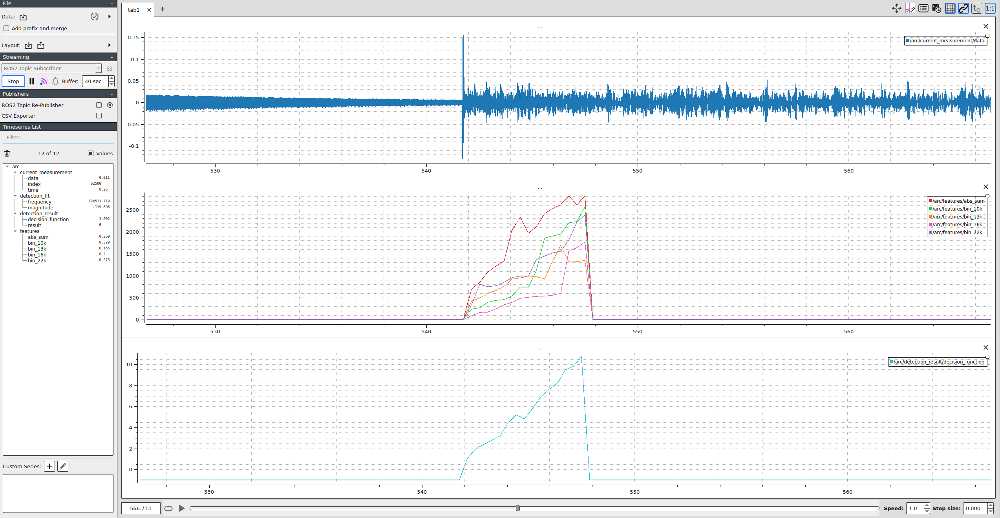

# ArcDetection
ML Project for real-time arc detection

The project is meant to be used as a ROS2 package. This means it would be installed in the src directory of ROS2 workspace.

The dataset for training can be found in this link:
https://data.mendeley.com/datasets/pd93m3c4rz/1

Plotjugler is used for visualization.

## Workspace structure

This project assumes the dataset is stored in a subfolder called arc_data. The workspace structure, including the dataset, would look like this:

workspace

|--src

|----ArcDetection

|------arc_data

## ArcDetection package structure

workspace

|----src

|--------ArcDetection

|------------arc_data

|------------analysis

|----------------preprocessed_data

|--------------------processed_data.csv

|----------------process_notebook.ipynb

|----------------fft_calculator.cpp

|----------------CMakeLists.txt

|----------------batch_feature_extraction_double_window.py

|----------------model_training.py

|------------interfaces

|------------launch

|------------params

|------------ros_sources

|----------------common

|----------------adc

|----------------dma

|----------------detection

## Analysis folder

Not used By ROS.

This folder contains code to preform the analysis on the dataset and training of the model.

1. process_notebook.ipynb

Notebook documenting the exploratory data analysis (EDA), feature selection, and training. This is meant as a guide to understand the process.

2. fft_calculator.cpp and CMakeLists.txt

This is a C++ function wrapped with pybind11. This function calculates an spectrogram and is used by the python scripts so that the feature extraction can be performed with the exact code and libraries used in the real-time C++ application.
This code needs to be built so that the python scripts can use it.

i. Create a build folder next to fft_calculator.cpp
mkdir build && cd build
ii. From inside the folder do:
cmake ..
iii. Then:
make install

This will expose an fft_calculator.so module

3. batch_feature_extraction_double_window.py

The dataset consists of several files representing sensor data stored as time series. A script is provided to extract the features from all files and consolidate them in a single file. This is a step performed based on the exploratory data analysis (EDA).

Running the script like this will look at the dataset in ../arc_data/raw and store the extracted features in a single file in ./preprocessed_data/processed_data.csv
python3 batch_feature_extraction_double_window.py ../arc_data/raw preprocessed_data

4. preprocessed_data/processed_data.csv

This is the data resulting from extracting the features from the whole dataset. This file can be used directly for feature selection and model training.

5. model_training.py

This script uses the processed data csv file and trains a model based on the selected features. It prints the weights for a SVM linear kernel model so that it can be used in the C++ code.

## interfaces folder

Used by ROS.

Defines the custom messages to transfer data in the simulated real-time scenario

## params folder

Used by ROS.

Defines the input file for the simulation as well as the speed at which the simulation will run.

## launch folder

Used By ROS.

Contains the launch script to start the necessary nodes.

## ros_sources folder

Used By ROS.

This is the C++ code for the simulation. It creates three nodes:
1. adc_model : Reads a data file line by line mocking the sampling behavior of an ADC. Sends the data to the DAM module.
2. dma_model : Receives the adc data and stores in a buffer of predefined size. Sends this buffer to the detection module.
3. detection_model : Performs the feature extraction and SVM model prediction to detect the fault.

As described, the three nodes are linked in a sequence like this: adc->dma->detection
The DMA and detection models run on reception of data, making the ADC the main controller of the simulation tick. This resembles a HW implementation where the ADC is configured with a fixed clock and the detection model is triggered by an interruption.

To build the ROS simulation:

i. Go to the base of the workspace
ii. Do:
colcon build --symlink-install
iii. Then:
source install/setup.bash

To start:

ros2 launch arc_detection arc_sim.launch.py

Notes:
1. The simulation waits for 2 subscribers to be ready to start transferring data. 1 subscriber is the DMA and the second one is plotjuggler for visualization
2. The yaml file with parameters is defined in the launch file. The parameters can be changed directly in the yaml file or a new one can be created and defined in the launch file. If not build with symlink install option, you need to do colcon build after modifying the launch script so that it gets updated in the install folder.